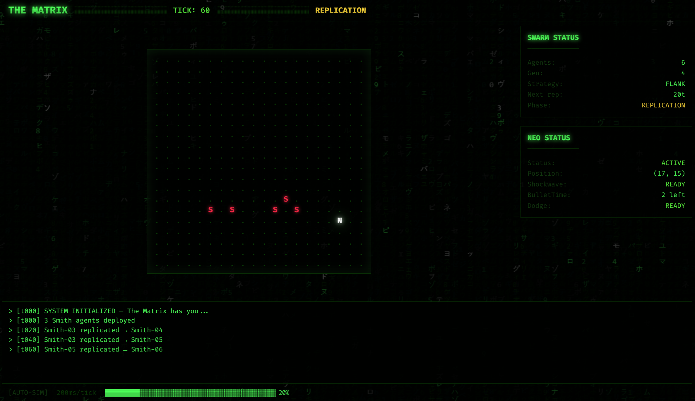
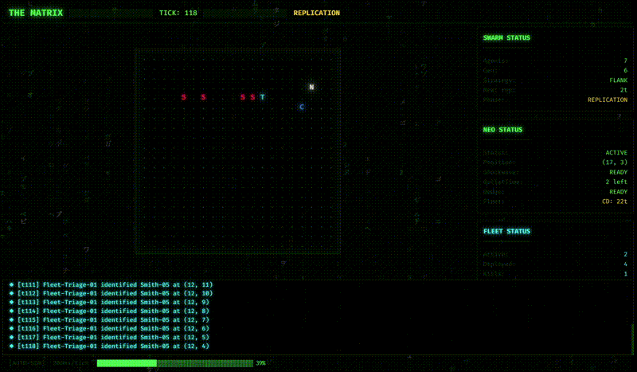

# The Matrix: Agent Smith Swarm Simulator

An autonomous AI battle simulation where Agent Smith's swarm AI hunts Neo across a Matrix-themed terminal. Watch as Smith agents replicate, coordinate, and employ sophisticated swarm strategies while Neo's survival AI fights back with shockwave blasts and bullet time.

## Overview

- **Fully autonomous** — no user input required. Launch and watch the battle unfold.
- **Dual UI** — run in your terminal (blessed) or browser (React + Canvas code rain).
- **Agent swarm patterns** — Chase, Flank, and Surround strategies with adaptive switching.
- **Neo AI** — autonomous survival agent with threat heatmap, dodge, bullet time, and shockwave.
- **MCP integration** — query and control the simulation via GitHub Copilot Chat.

## Real World Scenario: Threat Incident Swarm Commander

> *"An incident starts as one 'Agent Smith.' Within minutes, it multiplies across services and endpoints. My console shows the replication graph in real-time, explains the spawn reasons, and coordinates specialized agents — 'Neo' handles triage, diagnosis, mitigation, and comms — so responders can contain the spread instead of chasing tickets. 'Neo Agent' has a 'shockwave' that eliminates the threats. 'Neo Agent' can also deploy a fleet of agents depending on the threat and the agent that handles the threat and/or incident."*

This simulation models how cascading incidents behave in production systems:

- **Smith = Cascading Failure** — Each Smith agent represents a failure propagating across services, replicating through dependencies and adapting its strategy as it spreads. One alert becomes ten; ten become a hundred.
- **Neo = Incident Response Coordinator** — Neo is the autonomous response system that triages threats, prioritizes containment, and deploys targeted countermeasures. Neo doesn't just react — it deploys a **fleet of specialized agents** matched to each threat type.
- **Shockwave = Mass Remediation** — When threats cluster, Neo fires a shockwave: a coordinated, wide-area remediation that neutralizes multiple incidents simultaneously.
- **Bullet Time = Buying Time for Diagnosis** — Neo slows the incident cascade, giving responders a window to analyze root cause before the swarm overwhelms the system.
- **Agent Fleet Deployment** — Neo can spin up purpose-built agents on demand: a triage agent to classify severity, a diagnosis agent to trace root cause, a mitigation agent to apply fixes, and a comms agent to keep stakeholders informed.

The same swarm patterns powering this Matrix battle map directly to intelligent incident management:

| Swarm Strategy | Simulation Behavior | Incident Management Analogy |
|----------------|---------------------|-----------------------------|
| **Chase** | Direct pursuit of Neo | Direct alert routing to the on-call responder |
| **Flank** | Intercept escape routes | Preemptive mitigation of downstream services |
| **Surround** | Form a perimeter ring | Coordinated containment across all affected endpoints |

The MCP integration layer demonstrates how a responder could query the state of an active incident swarm, inject new signals, or override response strategy in real time through natural language — the same way a site reliability engineer would interact with a live incident command center.

## Quick Start

### Install Dependencies

```bash
# From the matrix-smith-swarm/ directory:
npm install

# For the web UI:
npm run web:install

# For MCP server:
cd mcp-server && npm install
```

### Terminal UI (blessed)

```bash
npm run terminal
```

Green-on-black ASCII grid running directly in your terminal. Press `Q` to quit.

### Web UI (React + Canvas)

```bash
npm run web
```

Opens at `http://localhost:5173` — features Matrix code rain, CRT scanlines, shockwave animations, and a glowing terminal aesthetic.



### Demo



### MCP Server

```bash
npm run mcp
```

Exposes the running simulation as MCP tools for GitHub Copilot Chat.

## Architecture

```
matrix-smith-swarm/
├── engine/              # Shared game engine (zero UI deps)
│   ├── types.ts         # All interfaces and types
│   ├── config.ts        # Tunable simulation constants
│   ├── World.ts         # Grid state, bounds, distance
│   ├── NeoAgent.ts      # Autonomous Neo AI (threat heatmap)
│   ├── SmithAgent.ts    # Individual Smith agent (state machine)
│   ├── Swarm.ts         # Swarm coordinator (replication, strategy)
│   ├── Simulation.ts    # Main tick loop, phase management
│   └── strategies/
│       ├── ChaseStrategy.ts     # Direct pursuit
│       ├── FlankStrategy.ts     # Intercept escape routes
│       └── SurroundStrategy.ts  # Form perimeter ring
├── terminal/            # CLI UI (blessed)
│   ├── index.ts
│   ├── TerminalRenderer.ts
│   └── effects.ts
├── web/                 # Browser UI (Vite + React)
│   └── src/
│       ├── components/  # MatrixTerminal, SimGrid, CodeRain, etc.
│       └── styles/      # matrix.css, crt.css
└── mcp-server/          # MCP server for Copilot integration
    └── src/
        ├── index.ts
        └── tools.ts     # get_matrix_state, spawn_smith, etc.
```

## Simulation Phases

| Phase | Ticks | What Happens |
|-------|-------|-------------|
| **HUNT** | 0–50 | 3 Smiths spawn and chase Neo |
| **REPLICATION** | 50–150 | Smiths replicate every 20 ticks, strategies escalate |
| **BURLY BRAWL** | 150–300 | Max swarm density, surround tactics, shockwaves fire |
| **RESOLUTION** | End | Neo survives 300 ticks (wins) or gets captured (Smith wins) |

## Neo's Abilities (Auto-Triggered)

| Ability | Trigger | Effect |
|---------|---------|--------|
| **Move** | Every tick | Moves toward lowest threat-density tile |
| **Dodge** | Smith on same tile | Phase through, 5-tick cooldown |
| **Bullet Time** | 5+ Smiths within 3 tiles | Smiths skip 5 ticks (2 uses) |
| **Shockwave** | 3+ Smiths within 2 tiles | Radial blast — knockback, destroy on wall, stun others (30-tick CD) |

## MCP Tools

| Tool | Description |
|------|-------------|
| `get_matrix_state` | Current grid, Neo position, swarm status, phase |
| `get_swarm_telemetry` | Detailed per-agent data — position, state, strategy |
| `spawn_smith` | Inject a new Smith at (x, y) coordinates |
| `set_swarm_strategy` | Override swarm tactic (CHASE / FLANK / SURROUND) |
| `get_simulation_log` | Recent event log entries |

### Using with Copilot Chat

Add to your VS Code MCP settings:

```json
{
  "mcp": {
    "servers": {
      "matrix-swarm": {
        "command": "npx",
        "args": ["tsx", "mcp-server/src/index.ts"],
        "cwd": "<path-to>/matrix-smith-swarm"
      }
    }
  }
}
```

Then ask Copilot: *"How many Smiths are active?"*, *"Spawn 5 Smiths on the east side"*, *"Switch to surround strategy"*.

## Built With

- **GitHub Copilot** — AI-assisted development throughout
- **TypeScript** — shared engine, terminal, web, and MCP server
- **React + Vite** — web UI with Canvas code rain
- **blessed** — terminal UI with ANSI rendering
- **@modelcontextprotocol/sdk** — MCP server integration

## Neo Fleet as Foundry Agents — Implementation Plan

The four Neo fleet agents (Triage, Diagnosis, Mitigation, Comms) currently operate as rule-based state machines in the TypeScript engine. The next phase elevates them into **Microsoft Foundry Agents** powered by the **Microsoft Agent Framework**, giving each agent real AI reasoning, tool use, and multi-agent coordination via workflows.

### Architecture: Simulation ↔ Agent Framework Bridge

```
┌────────────────────────────────────┐
│  TypeScript Simulation Engine      │
│  (tick loop, grid, fleet state)    │
│         │                          │
│    MCP Server (existing)           │
│         │ HTTP/stdio               │
└─────────┼──────────────────────────┘
          │
┌─────────▼──────────────────────────┐
│  Python Agent Orchestrator         │
│  (agent_framework + AzureAIClient) │
│                                    │
│  ┌─────────┐  ┌───────────┐       │
│  │ Triage  │→│ Diagnosis │       │
│  │ Agent   │  │ Agent     │       │
│  └────┬────┘  └─────┬─────┘       │
│       │              │             │
│  ┌────▼────┐  ┌─────▼─────┐       │
│  │Mitigation│←│  Comms    │       │
│  │ Agent   │  │  Agent    │       │
│  └─────────┘  └───────────┘       │
│                                    │
│  WorkflowBuilder orchestrates      │
│  fan-out/fan-in across all four    │
└────────────────────────────────────┘
```

### Agent Role Definitions

| Agent | Simulation Role | Foundry Agent Behavior |
|-------|----------------|----------------------|
| **Triage** | Scouts, identifies nearest Smith | Classifies incident severity, prioritizes which threats to address first using `get_matrix_state` and `get_swarm_telemetry` tools |
| **Diagnosis** | Moves to Smith, stuns on contact | Analyzes root cause — queries simulation state, correlates Smith generation/strategy patterns, recommends containment approach |
| **Mitigation** | Seeks and destroys Smiths | Executes remediation — calls `spawn_smith` (to rebalance), `set_swarm_strategy` (to disrupt), or destroys targets via simulation API |
| **Comms** | Stays near Neo, boosts cooldowns | Synthesizes situation reports from `get_simulation_log`, broadcasts status updates, recommends when Neo should deploy shockwave or fleet |

### Implementation Phases

#### Phase 1: Agent Definitions (Python)

Each fleet role becomes a Foundry Agent via `AzureAIClient.create_agent()`:

```python
from agent_framework import (
    ChatAgent, ChatMessage, Executor, WorkflowBuilder,
    WorkflowContext, WorkflowOutputEvent, handler,
)
from agent_framework.azure import AzureAIClient
from azure.identity.aio import DefaultAzureCredential

ENDPOINT = "<your-foundry-project-endpoint>"
MODEL = "<your-foundry-model-deployment>"


# --- Tool definitions (backed by MCP server calls) ---

def get_matrix_state() -> str:
    """Get current simulation state — grid, Neo, swarm, phase."""
    ...  # HTTP call to MCP server

def get_swarm_telemetry() -> str:
    """Get per-agent Smith data — position, state, strategy, generation."""
    ...  # HTTP call to MCP server

def set_swarm_strategy(strategy: str) -> str:
    """Override swarm strategy to CHASE, FLANK or SURROUND."""
    ...  # HTTP call to MCP server

def get_simulation_log() -> str:
    """Get recent event log from the simulation."""
    ...  # HTTP call to MCP server
```

#### Phase 2: Executor Wrappers

Each agent is wrapped in an `Executor` subclass with typed `@handler` methods:

```python
class TriageExecutor(Executor):
    """Scouts the battlefield, classifies threats, and forwards priority targets."""
    agent: ChatAgent

    def __init__(self, agent: ChatAgent, id: str = "TriageAgent"):
        self.agent = agent
        super().__init__(id=id)

    @handler
    async def handle(self, message: ChatMessage,
                     ctx: WorkflowContext[list[ChatMessage]]) -> None:
        messages = [message]
        response = await self.agent.run(messages)
        messages.extend(response.messages)
        await ctx.send_message(messages)


class DiagnosisExecutor(Executor):
    """Analyzes root cause from triage report, recommends containment."""
    agent: ChatAgent

    def __init__(self, agent: ChatAgent, id: str = "DiagnosisAgent"):
        self.agent = agent
        super().__init__(id=id)

    @handler
    async def handle(self, messages: list[ChatMessage],
                     ctx: WorkflowContext[list[ChatMessage]]) -> None:
        response = await self.agent.run(messages)
        messages.extend(response.messages)
        await ctx.send_message(messages)


class MitigationExecutor(Executor):
    """Executes remediation actions based on diagnosis."""
    agent: ChatAgent

    def __init__(self, agent: ChatAgent, id: str = "MitigationAgent"):
        self.agent = agent
        super().__init__(id=id)

    @handler
    async def handle(self, messages: list[ChatMessage],
                     ctx: WorkflowContext[list[ChatMessage]]) -> None:
        response = await self.agent.run(messages)
        messages.extend(response.messages)
        await ctx.send_message(messages)


class CommsExecutor(Executor):
    """Synthesizes situation reports and broadcasts recommendations."""
    agent: ChatAgent

    def __init__(self, agent: ChatAgent, id: str = "CommsAgent"):
        self.agent = agent
        super().__init__(id=id)

    @handler
    async def handle(self, messages: list[ChatMessage],
                     ctx: WorkflowContext[Never, str]) -> None:
        response = await self.agent.run(messages)
        await ctx.yield_output(response.text)
```

#### Phase 3: Workflow Orchestration

Wire the four agents into a workflow using `WorkflowBuilder`:

```python
async def deploy_neo_fleet():
    async with (
        DefaultAzureCredential() as credential,
        AzureAIClient(
            project_endpoint=ENDPOINT,
            model_deployment_name=MODEL,
            credential=credential,
        ).create_agent(
            name="TriageAgent",
            instructions="You are a triage agent in an incident response system. "
                         "Analyze the current threat landscape and classify each "
                         "Smith agent by severity. Use get_matrix_state and "
                         "get_swarm_telemetry to assess the situation.",
            tools=[get_matrix_state, get_swarm_telemetry],
        ) as triage_agent,
        AzureAIClient(
            project_endpoint=ENDPOINT,
            model_deployment_name=MODEL,
            credential=credential,
        ).create_agent(
            name="DiagnosisAgent",
            instructions="You are a diagnosis agent. Given the triage report, "
                         "analyze root cause patterns — correlate Smith generations, "
                         "replication rates, and strategy shifts. Recommend which "
                         "threats to contain first.",
            tools=[get_swarm_telemetry, get_simulation_log],
        ) as diagnosis_agent,
        AzureAIClient(
            project_endpoint=ENDPOINT,
            model_deployment_name=MODEL,
            credential=credential,
        ).create_agent(
            name="MitigationAgent",
            instructions="You are a mitigation agent. Execute remediation based on "
                         "the diagnosis. Disrupt swarm coordination by overriding "
                         "strategy, or target specific Smith clusters for elimination.",
            tools=[set_swarm_strategy, get_matrix_state],
        ) as mitigation_agent,
        AzureAIClient(
            project_endpoint=ENDPOINT,
            model_deployment_name=MODEL,
            credential=credential,
        ).create_agent(
            name="CommsAgent",
            instructions="You are a communications agent. Synthesize a situation "
                         "report from all fleet activity. Summarize threats neutralized, "
                         "remaining risks, and recommended next actions for Neo.",
            tools=[get_simulation_log, get_matrix_state],
        ) as comms_agent,
    ):
        workflow = (
            WorkflowBuilder()
            .register_executor(lambda: TriageExecutor(triage_agent), name="Triage")
            .register_executor(lambda: DiagnosisExecutor(diagnosis_agent), name="Diagnosis")
            .register_executor(lambda: MitigationExecutor(mitigation_agent), name="Mitigation")
            .register_executor(lambda: CommsExecutor(comms_agent), name="Comms")
            .add_edge("Triage", "Diagnosis")
            .add_edge("Diagnosis", "Mitigation")
            .add_edge("Mitigation", "Comms")
            .set_start_executor("Triage")
            .build()
        )

        async for event in workflow.run_stream(
            ChatMessage(role="user", text="Neo fleet deployed. Assess and contain all active Smith threats.")
        ):
            if isinstance(event, WorkflowOutputEvent):
                print(f"Fleet SITREP: {event.data}")
```

#### Phase 4: Bridge Integration

Connect the Python agent orchestrator to the TypeScript simulation:

1. **MCP-as-tools** — Each Foundry Agent uses `MCPStdioTool` to connect directly to the simulation's MCP server, giving it live access to `get_matrix_state`, `spawn_smith`, etc.
2. **HTTP bridge** — Expose a FastAPI endpoint that the TypeScript simulation calls when Neo's fleet cooldown fires. The Python orchestrator runs the workflow, returns a SITREP, and the simulation applies the actions.
3. **Event feedback loop** — Comms agent output is pushed back into the simulation event log via `SimulationEvent` with `type: 'fleet'`, visible in both terminal and web UI.

```python
# MCP tool connection (alternative to HTTP calls)
from agent_framework import MCPStdioTool

matrix_mcp = MCPStdioTool(
    name="MatrixSwarmMCP",
    description="Live Matrix simulation — query state, spawn agents, override strategy",
    command="npx",
    args=["tsx", "mcp-server/src/index.ts"],
    load_prompts=False,
)

# Use as tool in any agent
AzureAIClient(...).create_agent(
    name="TriageAgent",
    instructions="...",
    tools=[matrix_mcp],
)
```

### File Structure (Planned)

```
matrix-smith-swarm/
├── agents/                    # NEW — Python Agent Framework
│   ├── requirements.txt       # agent-framework, azure-identity, fastapi
│   ├── config.py              # Foundry endpoint, model deployment
│   ├── tools.py               # Tool functions (MCP bridge)
│   ├── executors/
│   │   ├── triage.py          # TriageExecutor
│   │   ├── diagnosis.py       # DiagnosisExecutor
│   │   ├── mitigation.py      # MitigationExecutor
│   │   └── comms.py           # CommsExecutor
│   ├── workflow.py            # WorkflowBuilder orchestration
│   └── server.py              # FastAPI bridge for TS simulation
└── ...existing files...
```

### Key Dependencies

```
agent-framework
azure-identity
azure-ai-projects
fastapi
uvicorn
```

## GitHub Copilot Usage

This project was built using GitHub Copilot for:

- Scaffolding the simulation engine architecture
- Implementing swarm AI strategies (chase, flank, surround)
- Designing Neo's threat heatmap and survival AI
- Creating the Matrix terminal CSS theme and CRT effects
- Building the MCP server tool definitions
